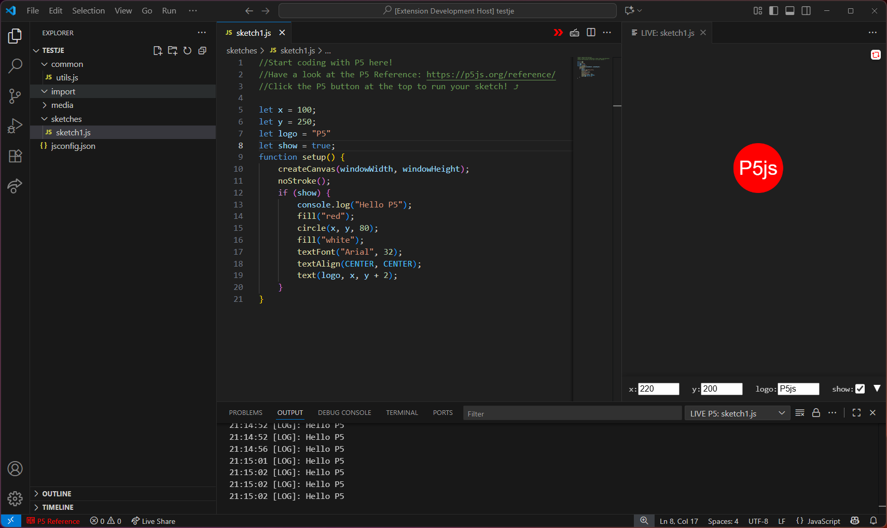

# LIVE P5 LAUNCHER

## Who am I & why did i develop this extension?
My name is Peter Dickx and I'm a coding teacher at [EHB (Erasmushogeschool Brussel)](http://www.ehb.be/).\
In the course [Multimedia & Creative Technologies](https://www.erasmushogeschool.be/nl/opleidingen/multimedia-en-creatieve-technologie) I teach the first course module **"Creative Coding I"**,\
in which students learn the basic concepts of coding, in a fun and creative way!

To make it easier for students to start coding, without having any prior technical knowledge, I created this extension as a teaching tool.
However it can be also be used as prototyping tool for any creative coder!

## Introduction
LIVE P5 LAUNCHER is a Visual Studio Code extension that brings live coding and rapid prototyping to p5.js sketches. It provides an interactive webview panel for instant feedback, variable control, and error reporting, making it ideal for creative coding, teaching, and experimentation with p5.js in JavaScript or TypeScript.



## Features
- **Live Preview:** Instantly see your p5.js sketch update as you type or save.
- **Global Variable Controls:** Automatically detects global variables and provides a UI to adjust them in real time.
- **Error Overlay:** Syntax and runtime errors are shown as overlays in the webview and logged in the Output panel.
- **Reload Button:** Manually reload your sketch and preserve variable values.
- **Auto Reload:** Optionally reload on typing or only on save (configurable).
- **Workspace Imports:** Automatically loads scripts from `common/` and `import/` folders in your workspace.
- **Include:** Automatically loads scripts and media from the `include/` folder in the same folder as the sketch.
- **P5 Reference Integration:** Quick access to the p5.js reference and lookup for selected text.
- **Project Bootstrap:** Quick setup to create a folder structure for p5.js projects and a `jsconfig.json` for p5js types intellisense.
- **Capture:** Record animations or graphics from the webview with a record button.
- **Save images:¨** Right click on your canvas to copy or save the current image.
- **Duplicate sketches:** Right click on a file and duplicate it.
- **OSC Bridge:** Send and Receive OSC messages with SendOSC(address,arguments) and the receivedOSC eventhandler.

## How to Use
1. **Install the Extension:**
   - Search for `P5 LIVE LAUNCHER` in the VS Code Extensions marketplace and install it.

2. **Project Setup:**
   - Automatic project setup notification.
   - OR Run `Live P5: Setup new P5 Project` to scaffold a p5.js project structure with `common/`, `import/`, `media/`, and `sketches/` folders and a jsconfig to enable autocompletion for p5.
   - If no folder/workspace is open, select a folder or create a new one using the dialog window.

2. **Open or Create a Sketch:**
   - Open a `.js` or `.ts` file with your p5.js code.
   - Use P5 Live BUTTON (or the command palette (`Ctrl+Shift+P` or `Cmd+Shift+P`) and run `Live P5: Open P5 Panel`).

3. **Live Coding:**
   - Edit your code and see changes instantly in the webview panel.
   - Adjust global variables using the controls at the bottom of the panel.
   - Errors will appear as overlays and in a dedicated output channel per sketch.

4. **Reload Options:**
   - Use the reload button in the webview to manually reload and preserve variable values.
   - Toggle auto-reload on typing or on save via in the settings.

5. **Import Scripts:**
   - Place shared code in `common/` or `import/` folders in your workspace. These scripts are loaded automatically in every sketch.
   - Place media in the `media/` folder and reference them with the MEDIA_FOLDER variable
   ex: mySound = loadSound(MEDIA_FOLDER + '/doorbell');

6. **P5 Reference:**
   - Use the status bar button or command palette to quickly open the p5.js reference.
   - Select text in your code, right click and choose "Search in P5 reference" for a shortcut.


## Configuration
All settings are under the `liveP5` namespace. You can configure these in your VS Code settings (search for "liveP5").

| Setting | Type | Default | Description |
|---|---|---|---|
| `liveP5.reloadOnSave` | boolean | `true` | Automatically reload the P5 webpanel when saving the file. |
| `liveP5.reloadWhileTyping` | boolean | `true` | Automatically reload the P5 webpanel as you type. |
| `liveP5.debounceDelay` | number | `300` | Debounce delay in milliseconds for live reload while typing. |
| `liveP5.varDrawerDefaultState` | string (`open`, `collapsed`, `hidden`) | `collapsed` | Default state of the global variable drawer in the P5 panel. |
| `liveP5.varControlDebounceDelay` | number | `500` | Debounce delay (ms) for global variable drawer input changes before applying them to the sketch. |
| `liveP5.showReloadButton` | boolean | `true` | Show the reload button in the webview toolbar. |
| `liveP5.showRecordButton` | boolean | `false` | Show the record (capture) button in the webview toolbar. |
| `liveP5.SingleP5Panel` | boolean | `true` | If enabled, only one P5 webpanel can be open at a time. Opening a new panel closes all others. |
| `liveP5.showSetupNotification` | boolean | `true` | Show a setup prompt when the workspace has no P5 configuration (`jsconfig.json`). |
| `liveP5.oscRemoteAddress` | string | `127.0.0.1` | OSC remote address (host to send OSC messages to). |
| `liveP5.oscRemotePort` | number | `57120` | OSC remote port (port to send OSC messages to). |
| `liveP5.oscLocalPort` | number | `57121` | OSC local port (port to listen for incoming OSC messages). |

## OSC (Open Sound Control)
LIVE P5 Launcher supports sending and receiving OSC (Open Sound Control) messages between your p5.js sketch and other OSC-compatible software or devices.

### Features
- **Send OSC messages** from your sketch to any remote OSC address/port.
- **Receive OSC messages** in your sketch from other OSC clients.
- Configure OSC remote/local address and ports in the extension settings.

### Usage

#### Sending OSC messages from your sketch
Use the global function `SendOSC(address, args)` in your p5.js code:

```js
// Send a message to /myAddress with two arguments
SendOSC('/myAddress', [42, 'hello']);
```
- `address`: The OSC address string (e.g., `/myAddress`)
- `args`: An array of arguments (numbers, strings, booleans)

#### Receiving OSC messages in your sketch
Define a global function `receivedOSC(address, args)` in your sketch. This function will be called automatically when an OSC message is received:

```js
function receivedOSC(address, args) {
   print('Received OSC:', address, args);
   // Handle incoming OSC messages here
}
```
- `address`: The OSC address string of the received message
- `args`: An array of arguments

### Configuration
You can configure the OSC connection in your VS Code settings:
- `liveP5.oscRemoteAddress`: The remote host to send OSC messages to (default: `127.0.0.1`)
- `liveP5.oscRemotePort`: The remote port to send OSC messages to (default: `57120`)
- `liveP5.oscLocalPort`: The local port to listen for incoming OSC messages (default: `57121`)

This allows you to connect your p5.js sketches to other creative coding tools, DAWs, or hardware that support OSC.

## Tips
- For autocompletion of functions in import/common files, use a `jsconfig.json` and/or JSDoc references.
- Prototype extensions (e.g., `p5.prototype.myFunc`) may require a `.d.ts` or JSDoc shim for IntelliSense.

## License
[MIT](https://github.com/dickxpe/vscode-live-p5?tab=MIT-1-ov-file)

✅ Free use (commercial and non-commercial)

✅ Attribution required

✅ No restriction on modification, redistribution, etc.

🚫 No warranty / no liability

## Attributions
Shout out to: https://github.com/filipesabella/
with his extension vscode-live-p5
His project was the start for mine, initially i made a few UI Changes,
but i had a different vision for this tool and went back to the drawing board.
Not much of the original code is left in my project, but I still wanted to give credit to Filipe for his great work and inspiration!

## AI
This extension was developed with the use of github copilot & chatgpt.
Some code in this project was generated and/or refactored.