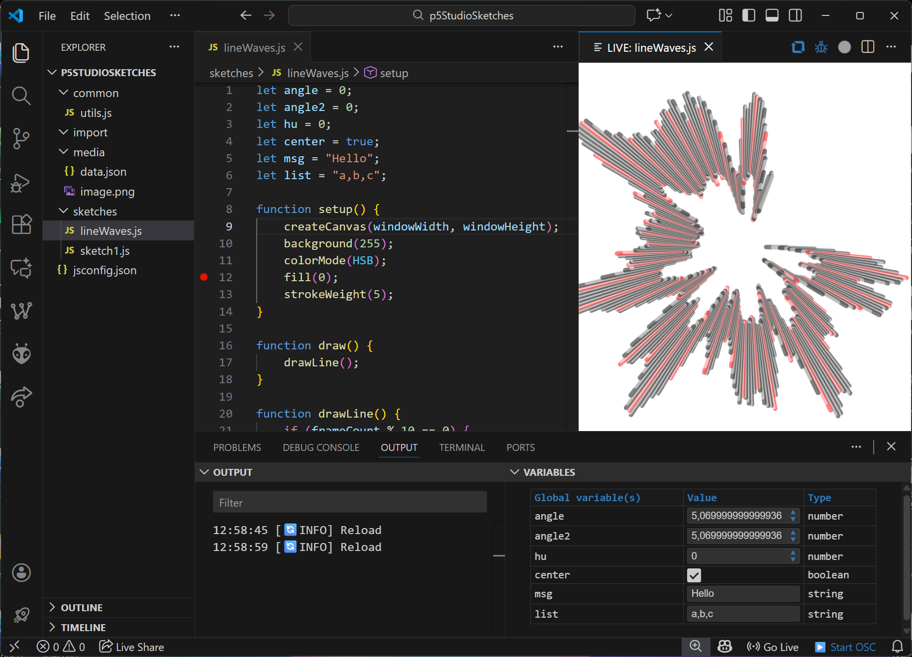

# P5 Studio
## Who am I & why did i develop this extension?
My name is Peter Dickx and I'm a coding teacher at [EHB (Erasmushogeschool Brussel)](http://www.ehb.be/).\
In the program [Multimedia & Creative Technologies](https://www.erasmushogeschool.be/nl/opleidingen/multimedia-en-creatieve-technologie) I teach the first course **"Creative Coding I"**,\
in which students learn the basic concepts of coding, in a fun and creative way!

To make it easier for students to start coding, without having any prior technical knowledge, I created this extension as a teaching tool.
However it can be also be used as a prototyping tool for any creative coder!

Like this extension and want to support me? Buy me a coffee: 

<a href="https://www.buymeacoffee.com/zebugames"></a>

## Introduction
**P5 Studio** is a Visual Studio Code extension that brings live coding and rapid prototyping to p5.js sketches. It provides an interactive webview panel for instant feedback, variable control, and error reporting, making it ideal for creative coding, teaching, and experimentation with p5.js in JavaScript or TypeScript.



## Features
- **Live Preview:** Instantly see your p5.js sketch update as you type or save.
- **Global Variable Controls:** Automatically detects global variables and provides a UI to adjust them in real time.
- **Error Overlay:** Syntax and runtime errors are shown as overlays in the webview and logged in the Output panel.
- **Reload Button:** Manually reload your sketch
- **Auto Reload:** Optionally reload on typing or only on save (configurable).
- **Workspace Imports:** Automatically loads scripts from `common/` and `import/` folders in your workspace.
- **Include:** Automatically loads scripts and media from the `include/` folder in the same folder as the sketch.
- **P5 Reference Integration:** Quick access to the p5.js reference and lookup for selected text.
- **Project Bootstrap:** Quick setup to create a folder structure for p5.js projects and a `jsconfig.json` for p5js types intellisense.
- **Pause/Resume Draw Loop:** A context-aware pause/play button in the editor title bar lets you toggle the sketch loop (`noLoop()` / `loop()`) without reloading when your code defines `draw()`.
- **Debugging and Stepping:** 
   - Step through your code line by line.
   - Continue to the next breakpoint.
   - Automatically run stepping with configurable intervals.
   - Stop debugging at any time.
   - Visualize local variable values in the variables panel.
- **Capture:** Record animations or graphics from the webview with a record button.
- **Save images:¨** Right click on your canvas to copy or save the current image.
- **Duplicate sketches:** Right click on a file and duplicate it.
- **OSC Bridge:** Send and Receive OSC messages with `sendOSC(address, args)` and the `receivedOSC(address, args)` handler.
- **p5js v2 support:** Switch between v1.11 and 2.1

## How to Use
1. **Install the Extension:**
   - Search for `P5 Studio` in the VS Code Extensions marketplace and install it.

2. **Project Setup:**
   - Automatic project setup notification.
   - OR Run `P5 Studio: Setup new P5 Project` to scaffold a p5.js project structure with `common/`, `import/`, `media/`, and `sketches/` folders and a jsconfig to enable autocompletion for p5.
   - If no folder/workspace is open, select a folder or create a new one using the dialog window.

2. **Open or Create a Sketch:**
   - Open a `.js` or `.ts` file with your p5.js code.
   - Use P5 Live BUTTON (or the command palette (`Ctrl+Shift+P` or `Cmd+Shift+P`) and run `P5 Studio: Open P5 Panel`).

3. **Live Coding:**
   - Edit your code and see changes instantly in the webview panel.
   - Adjust global variables from the VARIABLES panel.
   - Errors will appear as overlays and in a dedicated output channel per sketch.

4. **Reload Options:**
   - Use the reload button in the webview to manually reload
   - Toggle auto-reload on typing or on save via in the settings.

5. **Import Scripts:**
   - Place shared code in `common/` or `import/` folders in your workspace. These scripts are loaded automatically in every sketch.
   - Place media in the `media/` folder and reference them with the MEDIA_FOLDER variable
   ex: mySound = loadSound(MEDIA_FOLDER + '/doorbell');

6. **P5 Reference:**
   - Use the status bar button or command palette to quickly open the p5.js reference.
   - Select text in your code, right click and choose "Search in P5 reference" for a shortcut.

## Configuration
All settings live under the `P5 Studio` namespace. Configure them from VS Code settings (search for "P5 Studio") or edit `settings.json` directly.

| Setting | Type | Default | Description |
|---|---|---|---|
| `P5Studio.P5jsVersion` | enum | `"1.11"` | Selects the bundled p5.js version for LIVE panels (2.1 currently ships without autocomplete). |
| `P5Studio.reloadOnSave` | boolean | `true` | Reload the P5 webview automatically when you save the sketch. |
| `P5Studio.reloadWhileTyping` | boolean | `false` | Reload the P5 webview automatically while typing. |
| `P5Studio.debounceDelay` | number (≥ `100`) | `250` | Debounce delay in milliseconds used when reload-on-typing is enabled. |
| `P5Studio.variablePanelDebounceDelay` | number (≥ `10`) | `50` | Debounce delay in milliseconds before VARIABLE panel edits sync to the sketch. |
| `P5Studio.showRecordButton` | boolean | `true` | Show the Record (Toggle Capture Panel) button in the editor title bar for P5 panels. |
| `P5Studio.SingleP5Panel` | boolean | `true` | Keep only one P5 webview open at a time; opening another closes existing panels. |
| `P5Studio.showSetupNotification` | boolean | `true` | Display the setup prompt when no `.p5` marker is detected in the workspace. |
| `P5Studio.showFPS` | boolean | `false` | Overlay the current FPS (derived from `deltaTime`) in the top-left of the P5 webview. |
| `P5Studio.editorFontSize` | number (≥ `6`) | `14` | Extension-managed editor font size mirrored to `editor.fontSize` on startup. |
| `P5Studio.loopGuard.MaxIterations` | number  (≥ `100`)  | `10000` | Maximum number of iterations allowed per loop before halting execution. |
| `P5Studio.loopGuard.MaxTimeMs` | number  (≥ `50`)  | `500` | Maximum time in milliseconds allowed per loop before halting execution. |
| `P5Studio.osc.oscRemoteAddress` | string | `"127.0.0.1"` | OSC destination host for outbound messages. |
| `P5Studio.osc.oscRemotePort` | number | `57120` | OSC destination port for outbound messages. |
| `P5Studio.osc.oscLocalAddress` | string | `"127.0.0.1"` | OSC bind address for inbound messages (`0.0.0.0` allows LAN clients). |
| `P5Studio.osc.oscLocalPort` | number | `57121` | OSC listening port for inbound messages. |
| `P5Studio.blockly.enableBlockly` | boolean | `true` | Enable Blockly integration, exposing the Blockly button and context menu entry. |
| `P5Studio.blockly.blocklyTheme` | enum | `"auto"` | Theme applied to the Blockly panel (`auto` follows the VS Code theme). |
| `P5Studio.debug.ShowDebugButton` | boolean | `true` | Show the beta Debug button that primes sketches for step execution. |
| `P5Studio.debug.stepRunDelayMs` | number (≥ `0`) | `250` | Delay in milliseconds between Step-Run iterations. |
| `P5Studio.lint.StrictSemicolonWarning` | enum | `"block"` | Severity for missing semicolons (overlay when set to `block`). |
| `P5Studio.lint.StrictUndeclaredWarning` | enum | `"block"` | Severity for undeclared variable usage. |
| `P5Studio.lint.StrictNoVarWarning` | enum | `"block"` | Severity for `var` usage instead of `let`/`const`. |
| `P5Studio.lint.StrictLooseEqualityWarning` | enum | `"ignore"` | Severity for using `==` / `!=` instead of strict equality. |
| `P5Studio.lint.logWarningsToOutput` | boolean | `true` | Mirror lint warnings to the Output panel in addition to the webview overlay. |


## OSC (Open Sound Control)
P5 Studio supports sending and receiving OSC (Open Sound Control) messages between your p5.js sketch and other OSC-compatible software or devices.

### Features
- **Send OSC messages** from your sketch to any remote OSC address/port.
- **Receive OSC messages** in your sketch from other OSC clients.
- Configure OSC remote/local address and ports in the extension settings.
- Start/Stop the OSC server with the "Start OSC" or "Stop OSC" statusbar button.

### Usage

#### Sending OSC messages from your sketch
Use the global function `sendOSC(address, args)` in your p5.js code:

```js
// Send a message to /myAddress with two arguments
sendOSC('/myAddress', [42, 'hello']);
```
- `address`: The OSC address string (e.g., `/myAddress`)
- `args`: An array of arguments (numbers, strings, booleans)

#### Receiving OSC messages in your sketch
Define a global function `receivedOSC(address, args)` in your sketch. This function will be called automatically when an OSC message is received:

```js
function receivedOSC(address, args) {
   // Convert OSC metadata objects (from osc.js) into plain JS values
   const values = oscArgsToArray(args);
   output('Received OSC:', address, values[0]);
   // Handle incoming OSC messages here
}
```
- `address`: The OSC address string of the received message
- `args`: An array of arguments (often objects like `{ type, value }` when sent with metadata)

#### Helper: `oscArgsToArray(args)`
OSC args can be delivered with type metadata objects. The helper `oscArgsToArray(args)` converts these into a plain array of JavaScript values.

#### Start/Stop the osc server from code
Use the global function `startOSC(localAddress, localPort, remoteAddress, remotePort)` in your p5.js code to start the OSC Server.

```js
   startOSC("0.0.0.0", 57121, "192.168.0.1", 57120);
```

Use the global function `stopOSC()` in your p5.js code to stop the OSC Server.

```js
   stopOSC();
```

### Configuration
You can configure the OSC connection in your VS Code settings:
- `P5Studio.oscRemoteAddress`: The remote host to send OSC messages to (default: `127.0.0.1`)
- `P5Studio.oscLocalAddress`: The local bind address to receive on (default: `127.0.0.1`; set to `0.0.0.0` for LAN).
- `P5Studio.oscRemotePort`: The remote port to send OSC messages to (default: `57120`)
- `P5Studio.oscLocalPort`: The local port to listen for incoming OSC messages (default: `57121`)

This allows you to connect your p5.js sketches to other creative coding tools, DAWs, or hardware that support OSC.

### Tips & self-test
- To self-test without an external server, set the  `P5Studio.oscRemoteAddress` and  `P5Studio.oscLocalAddress` both to `127.0.0.1` and set `P5Studio.oscRemotePort` to match `P5Studio.oscLocalPort` (default `57121`) and call `sendOSC('/test', [1,'a',true])` from your sketch.
- To receive from another device on your network, set `P5Studio.oscLocalAddress` to `0.0.0.0`, keep `P5Studio.oscLocalPort` (e.g., `57121`), and send to your computer’s LAN IP at that port.

## Output / Input
- Log messages to the output channel with the output(msg) function
   ```js
   output("Hello");
   ```

- Place a inputPrompt() function call at the top of your file to prompt for input:
   ```js
   let a = inputPrompt();
   ```

## Custom CSS Support
You can style html elements in your sketches using your own CSS files. P5 Studio will automatically load and apply any `.css` files found in these locations:

- The `common/` folder at the root of your workspace (recursively)
- Any `include/` folder next to your sketch, its parent folder, or at the workspace root

All discovered CSS files are injected into the webview for every sketch.

**How to use:**
- Place your shared styles in `common/` (e.g., `common/global.css`)
- Place sketch-specific styles in an `include/` folder next to your sketch file
- All matching `.css` files will be loaded automatically when you open or reload a sketch
- **Note:** If you move or rename CSS files, reload the P5 panel to apply changes.

## Loop Guard Protection
To prevent infinite loops or runaway code from freezing your editor, P5 Studio automatically injects a loop guard into your sketches. This mechanism detects when a loop (such as `while`, `for`, or `do...while`) exceeds a safe number of iterations or runs for too long, and will stop execution with a clear error overlay in the webview.

**How it works:**
- Every loop in your code is instrumented with a guard counter and timer.
- If a loop exceeds the configured maximum number of iterations or total execution time, the sketch is halted and an error message is shown.
- This helps protect your editor and system from accidental infinite loops during live coding.
- You can adjust guard settings in your VS Code settings under the P5Studio.loopGuard section.

## Tips
- For autocompletion of functions in import/common files, use a `jsconfig.json` and/or JSDoc references.
- Prototype extensions (e.g., `p5.prototype.myFunc`) may require a `.d.ts` or JSDoc shim for IntelliSense.

## License
[MIT](https://github.com/dickxpe/p5-studio?tab=readme-ov-file#MIT-1-ov-file)

✅ Free use (commercial and non-commercial)

✅ Attribution required: Peter Dickx

✅ No restriction on modification, redistribution, etc.

🚫 No warranty / no liability

## Attributions
Shout out to: https://github.com/filipesabella/ with his extension vscode-live-p5.
His project was the start for mine, initially i made a few UI Changes,
but i had a different vision for this tool and went back to the drawing board.
Not much of the original code is left in my project, but I still wanted to give credit to Filipe for his great work and inspiration!
Also a shout out to https://github.com/p5-types for generating the P5 type definitions for p5.js 1.x & 2.x!

## AI
This extension was developed with the use of github copilot & chatgpt.
Some code in this project was generated and/or refactored.
